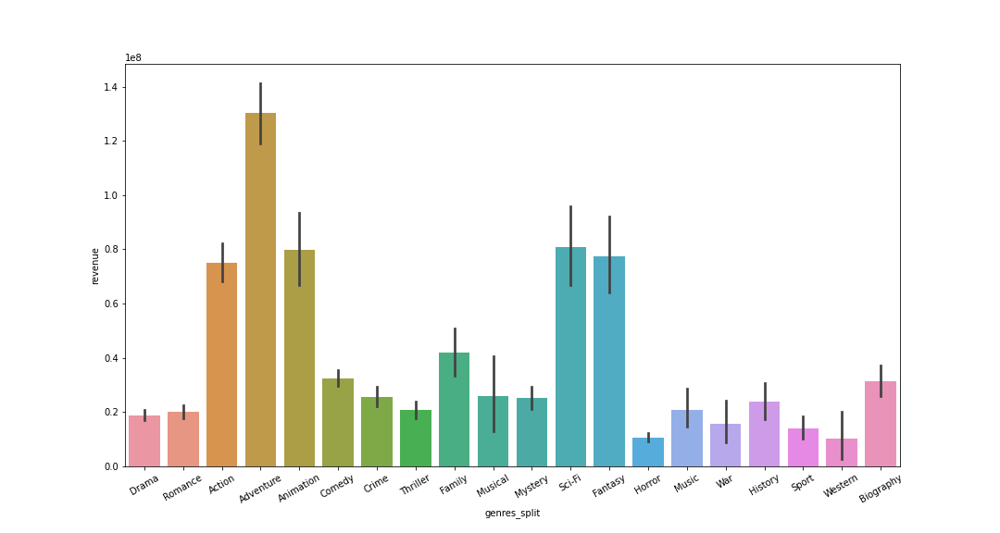

# Project_3
# Database construction and analysis with hypothesis testing
## Extract, Transform, and Load data into MySQL database to answer business questions with the certainty of hypothesis testing.

**Author**: Brian Lafferty

### Business Problem:

Extracting data regarding movie production, Transforming information into a usable form, Loading the data into a MySQL database for future use, and answering relevant business questions with statistical testing.

This project provided me with an enormous amount of experience. First, EXTRACTING public data with API calls. TRANSFORMING the data for storage and LOADING the data into a MySQL database I created. As the project continued with answering relevant business questions with statistical tests. Rejecting or failing to reject my hypotheses I was able to answer with certainty critical business questions.

### Data
Tens of thousands of movies from IMDb and The Movie Database (TMDB) covering features like title, revenue, rating, budget, and many more. The data was extracted in csv or json files with API calls. 

## Methods
- Extracted raw data from IMDb and used API calls to target specific information from TMDB
- Filtered, cleaned, and prepared data for processing
- Exploratory Data Analysis with visualizations
- Used MySQL to create a database containing multiple tables with Python
- Analyzed data using statistical tests to get a mathematically supported answer
- Discovered key findings about successful movies using hypothesis testing

## Database
During this project I created a MySQL database to store and access data that was extracted from the internet. I accessed the data and database tables with queries from MySQL as well as from Python using the library sqlalchemy.

## Results

> Created an Entity Relationship Diagram for the database for easy visualization.

> Visualizing the findings from a statistical test regarding movie genre and revenue generation.

## Recommendations and Findings:
- Movie rating affects how much revenue it will generate. Creating content with a targeted rating will impact the potential revenue generated.
- The genre of a movie affects how much revenue is generated during box office release. Similar to rating specific genres like Adventure, Action, Animation, Fantasy and Sci-Fi generate the highest earnings.
- Positive reviews of a movie also lead to increased revenue. Movies with a rating above 8 generated an average of $200 million more in revenue compared to those who did not.

## Limitations & Next Steps
In the future I would like to add an additional section to this project. I have learned about the four assumptions of a linear regression model. Using these tests I hope to analyze the data again with a linear regression model and determine critical features that impact movie success. Identifying which features positively or negatively impact a movie would lead to direct recommendations and actionable findings from the data.

### For further information

For any additional questions, please contact me on [LinkedIn](https://www.linkedin.com/in/brian-lafferty). 
